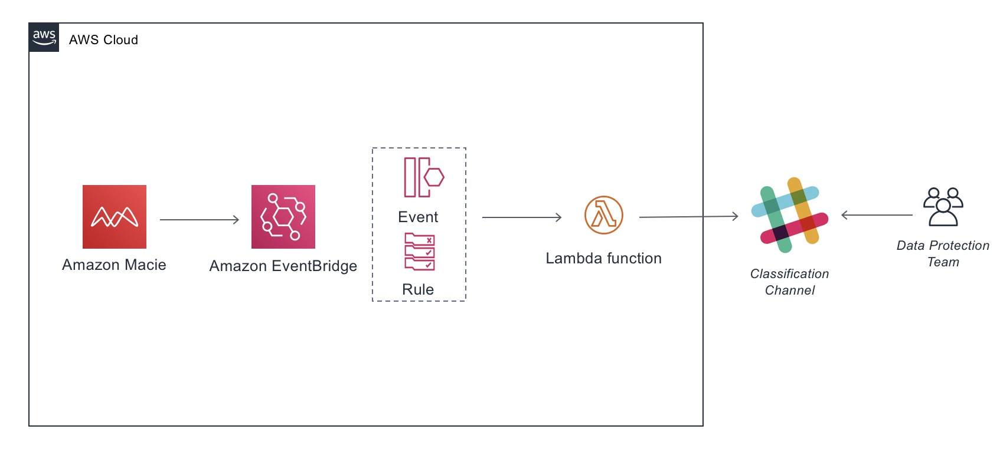

# Macie Findings integration with Slack Channel

This solution explore patterns to responde Macie findings via a notification workshow using Amazon EventBridge, AWS Lambda and Slack.

We will setup a Event Rule that will send the details of a Macie Finding to a Lambda function that will format the message and then post into our demo Slack Sensitive Data Classification channel.

### Solution Overview

### Setup Slack 

1. Use the following link to create a new Slack Workspace for yourself:  
https://get.slack.help/hc/en-us/articles/206845317-Create-a-Slack-workspace 
 
_Note After completing these steps, you should have a slack workspace with a name you used to create it. Keep this information handy._

### Create a channel to receive Macie Findings

When you created the Slack workspace, you would have typed in something under “What is your Company doing?”. This sets up a default channel on Slack. You can choose to use this to receive Macie findings or create a new channel.

_Note If you want to create a new channel click on the **+** next to **Channels** and create a new channel._

### Create an Incoming Webhook in Slack API 

1. Go to your Slack API(https://api.slack.com).  
2. Click **Start Building**.  
3. Click on **Create Your Slack App** button. 
4.  Click on **Create New App** button. 
5.  Fill in the following details for your app:  
- **App Name**: macie-to-slack 
- **Development Slack Workspace**: Choose the Slack workspace that will receive the Macie findings (this is the one you created)  
6. Click the **Create App** Button.
7.  Select **Incoming Webhooks**. 
8.  At the **Activate Incoming Webhooks** screen, move the slider from OFF to ON. 
9. Scroll down and choose **Add New Webhook to Workspace**. 
10. In the screen asking where your app should post, choose the channel that you created in an earlier step.
11. On the next screen, scroll down to the **Webhook URL section** and save the **URL** as you will need it later to complete your setup.

### Deploy the Cloudformation Template with the Solution

1. Download the deploy/template.yaml file in your computer
2. Open the [CloudFormation](https://console.aws.amazon.com/cloudformation/).
3. On the Welcome page, click on **Create stack** button.
4. On the Step 1 - Specify template: Choose Upload a template file, click on **Choose file** button and select the **template.yaml**.
5. On the Step 2 - Specify stack parameters: Enter the **IncomingWebHookURL** with the **WebHook URL** and **SlackChannel** with the name of your channel.
6. On the Step 3 - Configure stack options: Just click on **Next** button.
7. On the Step 4 - Review: Enable the checkbox **I acknowledge that AWS CloudFormation might create IAM resources with custom names.**, and click on **Create Stack** button.
8. Wait for the stack get into status **CREATE_COMPLETE**.

## Clean up

1. Open the CloudFormation console at https://console.aws.amazon.com/cloudformation
2. Select the Stack and click on **Delete** button

## Reference links

https://docs.aws.amazon.com/macie/latest/user/findings-monitor-events-eventbridge.html

https://aws.amazon.com/blogs/apn/how-to-enable-custom-actions-in-aws-security-hub/

## Security

See [CONTRIBUTING](CONTRIBUTING.md#security-issue-notifications) for more information.

## License

This sample code is made available under the MIT-0 license. See the LICENSE file.
